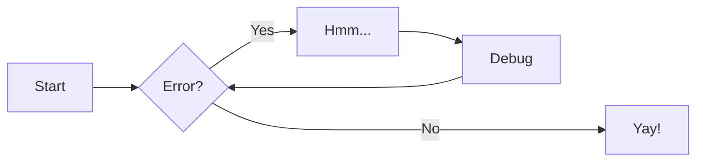

# Getting Started

This page is an overview of the OCR-D with Kitodo documentation and related resources.

## Architecture

``` mermaid
graph LR
  A[Start] --> B{Error?};
  B -->|Yes| C[Hmm...];
  C --> D[Debug];
  D --> B;
  B ---->|No| E[Yay!];
```