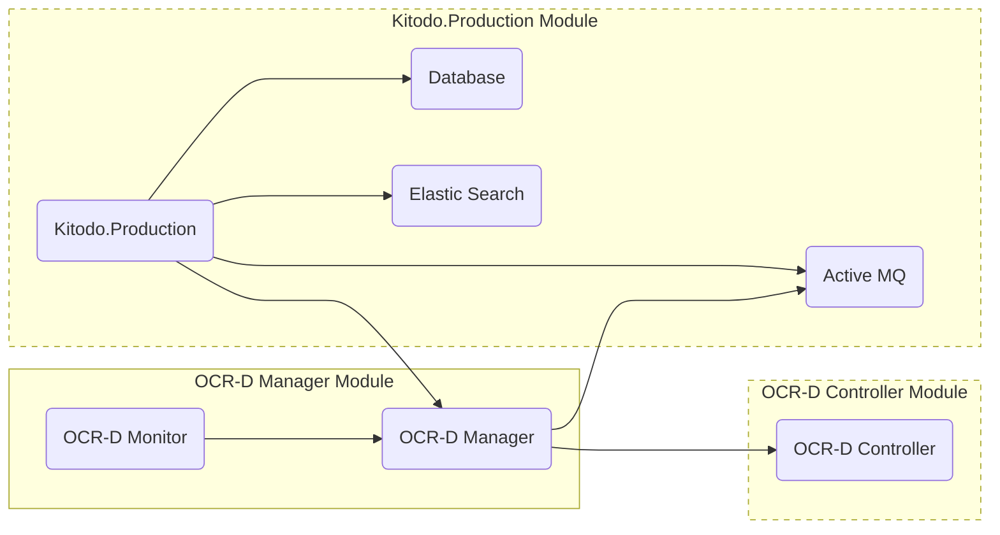

# Getting Started

This page is an overview of the OCR-D with Kitodo documentation and related resources.

# Architecture

The structure of our project consists of three modules whereby the OCR-D Controller and Kitodo.Production module are optional.
For these modules an existing [OCR-D Controller](https://github.com/slub/ocrd_controller) and/or [Kitodo.Production](https://github.com/kitodo/kitodo-production) installation can be used.

The OCR-D Manager module contains the homonymous OCR-D Manager and the OCR-D Monitor. The OCR-D Manager mediates between Kitodo.Production and OCR-Controller on system level.
This process is saved as job. The OCR-D Monitor provides a web interface to view running or already completed jobs and their workflow and in the future also to manage workflows and trigger jobs.

In addition to Kitodo.Production, Kitodo.Presentation or other applications can also be linked to the OCR-D Manager. For Kitodo.Presentation the OCR-D manager already brings a possible script for use or customization with it.

## Planned architecture of integration project

Our implementation project "[Integration of Kitodo and OCR-D for productive mass digitisation](https://ocr-d.de/en/phase3#integration-of-kitodo-and-ocr-d-for-productive-mass-digitisation)" is intended to enable the use of OCR-D in mass digitization with Kitodo.

