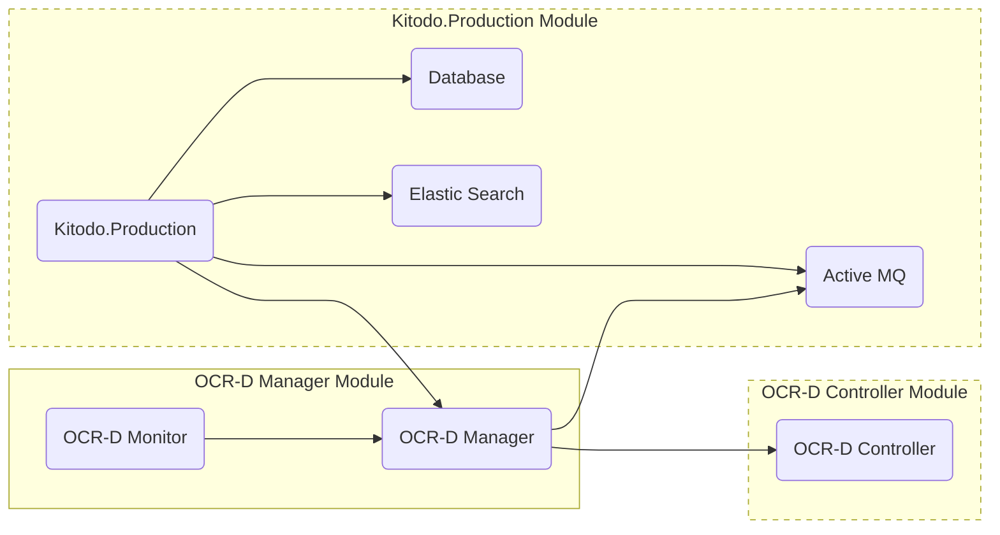

# Getting Started

This page is an overview of the OCR-D with Kitodo documentation and related resources.

# Architecture

## Overview of Modules

``` mermaid
graph LR
MA(OCR-D Manager) ----> CO(OCR-D Controller)
MO(OCR-D Monitor) ----> MA
KP(Kitodo.Production) ----> MA
KP ----> DB(Database)
KP ----> EL(Elastic Search)
KP ----> MQ(Active MQ)
MA ----> MQ
subgraph OCR-D Manager Module
MO
MA
end
subgraph COM[OCR-D Controller Module]
CO
end
subgraph KPM[Kitodo.Production Module]
DB
EL
MQ
KP
end

style KPM stroke-dasharray: 5 5
style COM stroke-dasharray: 5 5
```

## Example architecture

